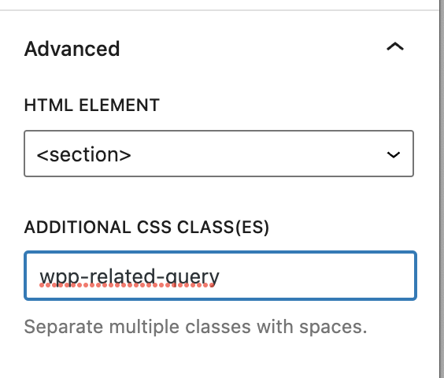

# wp-performance-related-query-block

## Beta, use it with careful

Plugin for remove current post when you use a query block post in page post

Actualy, for version 6.1 of WordPress, it's not possible to filter id of current post in query block for remove it.
When you add Query Block in page, you can see the current post in result of query block.

This plugin, parse html for remove current post in query block.

## how to use it

Just add class ```wpp-related-query``` in your query loop block.


